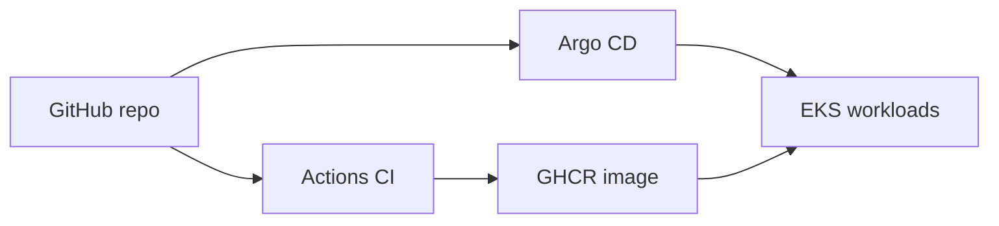

# kubernetes-mono-app

Portfolio mono-repo: **Go API**, **GitOps (Argo CD)**, **EKS-oriented manifests** (ALB Ingress, CloudNativePG, Redis), and **GitHub Actions** for CI plus Argo bootstrap/teardown.

> **Costs:** EKS control plane, NAT gateways, ALB, and EBS volumes are not free. Tear down or scale down when not demoing.

## Overview

| Area | Path | Notes |
|------|------|--------|
| API | `apps/api` | HTTP `/health`, `/ready`, `/version`, `/items`, `/cache-demo`; goose migrations |
| GitOps | `deploy/gitops` | App-of-apps + per-stack `Application` CRs |
| Infra (Terraform) | `infra/aws/foundation`, `infra/aws/k8s_platform` | VPC, EKS, EBS CSI addon, GitHub OIDC roles, Helm AWS LB controller |
| Manifests | `deploy/base`, `deploy/overlays/aws-prod` | Kustomize; TLS via ALB **certificate discovery** (no ACM ARN in Git) |
| Argo install | `infra/argocd/values.yaml` | Used only by bootstrap (Actions or Helm CLI) |
| CI | `.github/workflows/ci.yaml` | `go test`, image push to GHCR on `main` |
| Runbooks | `docs/runbooks` | Bootstrap & teardown |

Full design: **`plan.md`**.



## Replace placeholders

1. **`repoURL` in `deploy/gitops/**/*.yaml`** — defaults to `https://github.com/michaelj43/kubernetes-mono-app.git`.
2. **Container image** — Kustomize uses `ghcr.io/michaelj43/kubernetes-mono-app/api:latest`; CI publishes `ghcr.io/<lowercase-github-owner>/kubernetes-mono-app/api` on `main`.
3. **Ingress hostname / TLS** — `deploy/base/api/ingress.yaml` declares `api.k8s.michaelj43.dev` and `spec.tls.hosts` so the **AWS Load Balancer Controller** can **discover** a matching **ACM** cert in the same account/region—**no certificate ARN in Git**. See [`docs/aws-domain-tls.md`](docs/aws-domain-tls.md).

## First full deploy (AWS + Argo)

After infra code is on `main`, follow **[`docs/post-merge-runbook.md`](docs/post-merge-runbook.md)** in order (Terraform → ACM / DNS → image on GHCR → Argo bootstrap → Route 53 alias).

## Quick start (local)

```bash
cd apps/api && go test ./...
cd ../../tests/component && docker compose -f docker-compose.yaml up --build
```

## Docs

- [`docs/post-merge-runbook.md`](docs/post-merge-runbook.md) — **ordered bring-up** after merge
- [`docs/github-actions.md`](docs/github-actions.md) — **Secrets** for Terraform + Argo workflows
- [`docs/architecture.md`](docs/architecture.md)
- [`docs/aws-domain-tls.md`](docs/aws-domain-tls.md)
- [`docs/gitops.md`](docs/gitops.md)
- [`docs/testing.md`](docs/testing.md)

## License

Private / personal portfolio — add a license if you open-source the repo.
