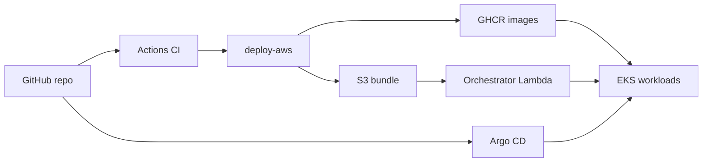

# kubernetes-mono-app

[](https://github.com/MichaelJ43/kubernetes-mono-app/actions/workflows/ci.yaml)
[](https://github.com/MichaelJ43/kubernetes-mono-app/actions/workflows/deploy-aws.yaml)
[](https://github.com/MichaelJ43/kubernetes-mono-app/actions/workflows/terraform-apply.yaml)

Portfolio mono-repo: **Go API**, **portal** (`k8s.michaelj43.dev` landing + public **`/status`**), **GitOps (Argo CD)**, **EKS-oriented manifests** (ALB Ingress, CloudNativePG, Redis), and **GitHub Actions** for CI plus Argo bootstrap/teardown.

> **Costs:** EKS control plane, NAT gateways, ALB, and EBS volumes are not free. Tear down or scale down when not demoing.

## Overview

| Area | Path | Notes |
|------|------|--------|
| API | `apps/api` | HTTP `/health`, `/ready`, `/version`, `/items`, `/cache-demo`; goose migrations |
| Portal | `apps/portal` | Static landing at **`k8s.michaelj43.dev`** + **`/status`** (Argo app names / health / sync); GHCR **`latest`** + **`deploy-aws`** pushes a **SHA** tag each merge; rendered manifests in the release bundle use that SHA (Git **`kustomization.yaml`** tags may lag unless you update them separately) |
| GitOps | `deploy/gitops` | App-of-apps + per-stack `Application` CRs |
| Infra (Terraform) | `infra/aws/github_deploy`, `infra/aws/foundation`, `infra/aws/k8s_platform`, `infra/aws/parked_site`, `infra/aws/deploy_orchestrator` | OIDC IAM (persisted), VPC/EKS, Helm AWS LB controller, parked S3/CloudFront, Lambda + source bucket + HTTP API for bundle deploy |
| Manifests | `deploy/base`, `deploy/overlays/aws-prod` | Kustomize; TLS via ALB **certificate discovery** (no ACM ARN in Git) |
| Argo install | `infra/argocd/values.yaml` | Used only by bootstrap (Actions or Helm CLI) |
| CI | `.github/workflows/ci.yaml` | `go test` (API + portal) on push/PR |
| Deploy AWS | `.github/workflows/deploy-aws.yaml` | After CI on `main`: GHCR build, release bundle → S3, `deploy_orchestrator` apply, `POST /deploy` |
| Swap / teardown | `.github/workflows/swap-stack.yaml`, `teardown-aws.yaml` | Manual: orchestrator `POST /swap` or teardown + destroy orchestrator stack |
| Static assets | `static/cluster-offline/` | Shipped inside the release bundle for **static** `site_mode` |
| Runbooks | `docs/runbooks` | Bootstrap & teardown |

Full design: **`plan.md`**.



## Replace placeholders

1. **`repoURL` in `deploy/gitops/**/*.yaml`** — defaults to `https://github.com/michaelj43/kubernetes-mono-app.git`.
2. **Container images** — **`deploy-aws`** (after CI on **`main`**) builds and pushes `ghcr.io/<lowercase-owner>/kubernetes-mono-app/{api,portal}:<sha>` and `:latest`, and bakes those tags into the bundle’s rendered YAML. Optionally align Git **`deploy/base/*/kustomization.yaml`** tags manually if you want Argo’s Git view to match.
3. **Ingress hostname / TLS** — `deploy/base/api/ingress.yaml` (`api.k8s…`) and `deploy/base/portal/ingress.yaml` (**apex `k8s.michaelj43.dev`**) set `spec.tls.hosts` so the **AWS Load Balancer Controller** can **discover** **ACM** (include **`k8s…`** + **`*.k8s…`** on the cert)—**no certificate ARN in Git**. See [`docs/aws-domain-tls.md`](docs/aws-domain-tls.md).

## First full deploy (AWS + Argo)

After infra code is on `main`, follow **[`docs/post-merge-runbook.md`](docs/post-merge-runbook.md)** in order (Terraform → ACM / DNS → parked site → merge to trigger CI + **deploy-aws** → Route 53 alias).

## Quick start (local)

```bash
cd apps/api && go test ./...
cd ../../tests/component && docker compose -f docker-compose.yaml up --build
```

## Docs

- [`docs/post-merge-runbook.md`](docs/post-merge-runbook.md) — **ordered bring-up** after merge
- [`docs/github-actions.md`](docs/github-actions.md) — **Secrets** for Terraform + Argo workflows
- [`docs/architecture.md`](docs/architecture.md)
- [`docs/aws-domain-tls.md`](docs/aws-domain-tls.md)
- [`docs/gitops.md`](docs/gitops.md)
- [`docs/testing.md`](docs/testing.md)

## License

Private / personal portfolio — add a license if you open-source the repo.
