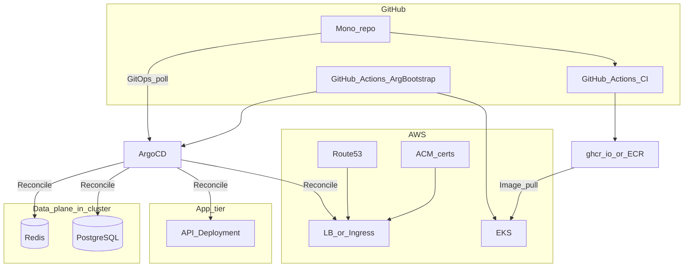

# kubernetes-mono-app — Portfolio plan

This document is the authoritative blueprint for the project: mono-repo layout, AWS hosting, TLS on a personal domain, data stores (PostgreSQL + Redis), GitOps via Argo CD, CI/CD boundaries, testing strategy, and documentation expectations.

---

## 1. Goals


| Goal             | How it is demonstrated                                                                                                        |
| ---------------- | ----------------------------------------------------------------------------------------------------------------------------- |
| **Kubernetes**   | EKS workloads, Ingress, StatefulSets/operators or Helm charts for DB/cache, probes, resources, secrets, storage classes       |
| **GitOps**       | Argo CD is the **only** continuous reconciler for **application and data-plane** manifests in-cluster; Git is source of truth |
| **AWS**          | EKS, Route 53, ACM (or equivalent), IAM; personal account, cost-aware                                                         |
| **Domain + TLS** | Public hostname under your domain; certificates requested and rotated in a documented way                                     |
| **Mono-repo**    | One GitHub repo (under your personal org); clear boundaries between app, platform, GitOps manifests, and automation           |
| **Operations**   | GitHub Actions for **lifecycle** tasks (bootstrap/teardown automation); Argo CD for **steady-state** infra for the app        |
| **Quality**      | Unit → component → live-dependency → contract → perf tests where applicable; docs at every layer                              |


---

## 2. Responsibility split: GitHub Actions vs Argo CD

Clarifying this split avoids fighting tools and duplicated ownership.

### 2.1 GitHub Actions (CI + platform lifecycle)

- **Continuous integration**: build, test (all applicable suites), lint, scan images, publish artifacts.
- **Image registry**: push to `ghcr.io/<org>/<repo>/...` (or ECR if you prefer AWS-native IAM).
- **Platform lifecycle** (your requirement: bring up / bring down **Argo CD**):
  - **Bring up**: workflow that assumes AWS credentials + `kubectl` context (via OIDC federation to AWS; no long-lived keys in GitHub Secrets if possible).
    - Create or attach to existing EKS cluster (cluster itself may be created by Terraform, CDK, `eksctl`, or a long-lived “foundation” workflow—pick one and document it).
    - Install **Argo CD** (Helm or official manifests), expose it in a way you accept for a personal portfolio (e.g., internal only + `kubectl port-forward`, or Ingress with SSO/password—your choice **must be documented**).
    - Register the cluster with Argo CD and apply the **root “app of apps”** Application manifest pointing at this repo (`deploy/gitops/root.yaml` or equivalent).
  - **Bring down**: workflow that optionally uninstalls Argo CD and related CRDs (**destructive**; document order and warnings). Useful for draining cost when not demoing—not for everyday app deployment.

### 2.2 Argo CD (steady-state GitOps)

- Owns everything that represents **desired cluster state for the workload**:
  - Application API Deployment, Services, Ingress, HPAs.
  - **PostgreSQL**: e.g., **CloudNativePG** `Cluster` CRD, **Zalando** Postgres operator, or a **production-style** Helm chart (Bitnami/other) with persistence—pick one stack and justify it in docs (operator vs StatefulSet simplicity tradeoff).
  - **Redis**: Helm chart or **Redis Operator** (or simplified **Redis Sentinel** chart if you want HA narrative)—again, one clear choice.
  - Supporting objects: namespaces, NetworkPolicies (optional stretch), PDBs if multi-replica, **ExternalSecrets** or **Sealed Secrets** integrations if secrets live in Git.
- **Bootstrap chicken-and-egg**: the first Application for “platform” may be applied once by Actions; afterward Argo manages updates. Document this explicitly.

### 2.3 Diagram




---

## 3. Mono-repo layout (recommended)

Adjust names to taste; keep **paths stable** because Argo CD and docs will reference them.

```
kubernetes-mono-app/
├── README.md                         # Landing: purpose, prerequisites, links to docs/
├── plan.md                           # This file — product/engineering blueprint
├── apps/
│   └── api/                          # HTTP API source
│       ├── Dockerfile
│       ├── docs/                     # App-specific README, ADRs if any
│       └── ...                       # Source, migrations, openapi spec
├── deploy/
│   ├── gitops/                       # What Argo CD watches
│   │   ├── root-app.yaml             # App-of-apps Application
│   │   └── apps/
│   │       ├── api.yaml              # Application for API kustomize/helm path
│   │       ├── postgres.yaml
│   │       ├── redis.yaml
│   │       └── ingress-cert.yaml     # Or combined with api
│   ├── base/                         # Kustomize base(s) or Helm values base
│   ├── overlays/
│   │   └── aws-prod/
│   └── helm/                         # Optional vendored/subcharts wrappers
├── infra/
│   ├── aws/                          # Terraform/CDK eksctl snapshots — OPTIONAL if cluster is hand-made
│   └── argocd/                       # Helm values or raw manifests FOR Argo bootstrap (used by Actions)
├── .github/
│   └── workflows/
│       ├── ci.yaml                   # PR + main: test, build, optionally push SHA-tagged images
│       ├── argocd-bootstrap.yaml     # Dispatch: install Argo + root app
│       └── argocd-teardown.yaml      # Dispatch: uninstall (guarded inputs)
├── docs/
│   ├── architecture.md               # End-to-end system view
│   ├── aws-domain-tls.md             # Hosted zone, records, ACM attachment to ingress
│   ├── gitops.md                     # Argo apps, sync policies, promotion
│   ├── runbooks/
│   │   ├── bootstrap.md
│   │   └── teardown.md
│   └── testing.md                    # Test matrix and how to run locally
└── tests/
    ├── contract/                     # Pact or OpenAPI-based contract tests
    ├── component/                    # Testcontainers / docker-compose for API+DB+Redis
    ├── live/                         # Scripts + markers for dependency tests (staging URL or in-cluster job)
    └── perf/                         # k6 or Locust; thresholds documented
```

**Convention**: `deploy/gitops/`** is the **only** path Argo CD syncs for application stack; `infra/argocd/`** is what **Actions** applies for Argo itself (version-pinned).

---

## 4. Application design (API + DB + cache)

### 4.1 API

- Endpoints: `GET /health`, `GET /ready` (readiness should check DB and Redis connectivity when configured), `GET /version`.
- Business logic minimal but **real**: e.g., `GET /items` reads from PostgreSQL; `GET /cache-demo` reads through Redis cache with TTL—enough to prove wiring.
- **Migrations**: embedded (e.g., golang-migrate, Flyway, Prisma) run as **init container** or **Job** before rollout; document order-of-operations.

### 4.2 PostgreSQL in Kubernetes

**Options** (choose one for the portfolio; document tradeoffs):


| Approach                           | Pros                               | Cons                      |
| ---------------------------------- | ---------------------------------- | ------------------------- |
| **Operator (e.g., CloudNativePG)** | Production-like CRDs, backup story | More concepts             |
| **Bitnami / Helm StatefulSet**     | Fast to stand up                   | “Chart maintenance” story |


Minimum: **persistent volume** via EBS CSI (gp3), **single primary** for portfolio cost; optional **read replica in the same EKS cluster** (HA / read offload—not cross-cluster or external RDS) as stretch.

### 4.3 Redis in Kubernetes

- **Cache** use case: single primary or small chart; persistence optional (AOF off for pure cache).
- Expose only inside cluster (`ClusterIP`); API connects via **Kubernetes DNS** service name.

### 4.4 Configuration and secrets

- **Non-secret**: ConfigMaps (DSN host parts can be templated from Helm/Kustomize).
- **Secrets**: database passwords, Redis auth—**not** in plain Git. Prefer:
  - **External Secrets Operator** + AWS Secrets Manager, or
  - **Sealed Secrets** with public key in repo, or
  - **Argo CD** + hand-applied Secret **once** (documented last resort).

---

## 5. AWS: EKS, domain, and certificates

### 5.1 EKS

- Fix a **Kubernetes minor version** in docs (e.g., 1.29+) and test upgrades deliberately.
- Node group: small instance types; autoscaling optional.
- **AWS Load Balancer Controller** (ALB) is a common pairing with EKS + ACM.

### 5.2 Route 53 + Cloudflare (Kubernetes slice of the domain)

- **Apex / other projects**: `michaelj43.dev` can stay on **Cloudflare** (or any registrar DNS) for non-EKS sites.
- **Kubernetes portfolio zone**: create a **Route 53 hosted zone** for **`k8s.michaelj43.dev`** (not the apex). This is the only zone this repo must manage in AWS for public names.
- **Delegation**: in Cloudflare, add **NS** records for `k8s` pointing to the **Route 53 nameservers** shown for that hosted zone. After propagation, any name `*.k8s.michaelj43.dev` is created in Route 53, not in Cloudflare.
- **Hostnames** (one label under `k8s.michaelj43.dev` matches the planned ACM wildcard):
  - **API Ingress**: e.g. `api.k8s.michaelj43.dev`.
  - **Optional**: `k8s.michaelj43.dev` itself (apex of the delegated zone) for a tiny landing or redirect.
  - **Argo CD** (only if you really expose it): e.g. `argocd.k8s.michaelj43.dev`—treat as sensitive; prefer `kubectl port-forward` or lock behind SSO / narrow IP allowlist.
- **Records**: in the **`k8s.michaelj43.dev`** Route 53 zone, use **alias** (or CNAME where required) to the ALB/NLB.

**Wildcard caveat** (same as any one-level `*`): `*.k8s.michaelj43.dev` covers `api.k8s.michaelj43.dev` but **not** two-level names like `api.foo.k8s.michaelj43.dev`. If you later need that shape, add SANs (e.g. `*.foo.k8s.michaelj43.dev`) or flatten names.

### 5.3 TLS — ACM + ALB Ingress (**chosen**)

**This project uses public ACM certificates and TLS termination on the AWS Load Balancer** (no cert-manager / Let’s Encrypt unless you revisit that later).

1. Request a **public certificate** in ACM (in the **same region as the ALB**) with SANs **`k8s.michaelj43.dev`** and **`*.k8s.michaelj43.dev`**.
2. **DNS validation**: because the delegated zone lives in Route 53, ACM DNS validation is straightforward (use **Create records in Route 53** from the ACM console, or equivalent automation).
3. Annotate Ingress with that certificate’s ARN so the ALB terminates TLS.

**Renewal**: ACM renews the cert automatically before expiry; no scheduler to run in-cluster.

### 5.4 IAM / GitHub Actions

- Use **OIDC** `aws-actions/configure-aws-credentials` with a role trusting `repo:ORG/REPO:ref:refs/heads/main`.
- Principle of least privilege: separate roles for bootstrap vs CI push if feasible.

---

## 6. GitHub: mono-repo under personal org

- Create repo `kubernetes-mono-app` under your **GitHub org** (same name optional).
- **Branch protection**: `main` requires CI green; optionally require PR reviews.
- **Container registry**: GHCR scoped to org; Actions push with `GITHUB_TOKEN` or `**packages: write`** permissions.

---

## 7. Testing strategy (“where applicable”)

Map tests to **purpose** so you do not over-test trivia.

### 7.1 Unit tests

- **Scope**: Pure functions, handlers with mocked repos, migration helpers.
- **Run**: Every PR and `main`; fast, parallel, no Docker required for core suites.

### 7.2 Component tests

- **Scope**: HTTP API against **Docker** or **Testcontainers**: PostgreSQL + Redis ephemeral containers alongside the API binary or container image.
- **Run**: CI on every PR (`docker compose`-style or programmatic Testcontainers).
- **Assertions**: Repository round-trips, cache hit/miss behavior, status codes—**same image** artifact as prod where possible (`target: production-build` optional).

### 7.3 Live-dependency (“integration”) tests

- **Scope**: Validates ** Helm chart wiring / Kustomize overlays / RBAC**: e.g., Job in-cluster that hits `http://api.namespace.svc` after deploy—or **staging** URL hitting real ALB (**post-deploy workflow** gated on Argo sync healthy).
- **Run**: Scheduled **nightly** or **on-demand** workflow after deploy; slower, flaky prevention with retries/timeouts documented in `docs/testing.md`.

### 7.4 Contract tests

- **Scope**: Consumers (even if hypothetical) obey **API contract**.
- **Tool**: **Pact** (consumer-driven) **or** **OpenAPI** + **Dredd/schemathesis**/`openapi-diff` CI step against generated spec (`apps/api/openapi.yaml`).
- **Artifact**: Fail CI on breaking API changes unless version bump + migration path.

### 7.5 Performance tests

- **Scope**: Smoke **k6** or **Locust** script: e.g., sustained modest RPS, p95 latency under threshold against `/items` hitting DB.
- **Run**: Manual `workflow_dispatch` or scheduled **off-peak** (never block every PR unless thresholds are trivial).
- **Output**: Stored summary artifact (JSON/HTML) linked from docs.

### 7.6 Matrix summary


| Layer           | Typical tools                 | Runs on               |
| --------------- | ----------------------------- | --------------------- |
| Unit            | `$lang test`                  | Every PR              |
| Component       | Testcontainers / Compose      | Every PR              |
| Live-dependency | In-cluster Job / staging curl | Post-merge or nightly |
| Contract        | Pact / OpenAPI                | PR + release          |
| Perf            | k6 / Locust                   | Manual / nightly      |


---

## 8. Documentation expectations (each layer)


| Layer                            | Document (minimum)                                                                  |
| -------------------------------- | ----------------------------------------------------------------------------------- |
| **Root** (`README.md`)           | What it does, prerequisites, links to docs, high-level diagram, **cost disclaimer** |
| `**docs/architecture.md`**       | Data flows: client → Ingress → API → Postgres/Redis; failure domains                |
| `**docs/aws-domain-tls.md**`     | DNS records, ACM + ALB Ingress, troubleshooting                                     |
| `**docs/gitops.md**`             | App-of-apps tree, sync options (auto vs manual), promotion, rollback                |
| `**docs/testing.md**`            | How to run each suite locally and in CI                                             |
| `**docs/runbooks/bootstrap.md**` | Order: cluster exists → OIDC → bootstrap workflow → verify Argo → sync apps         |
| `**docs/runbooks/teardown.md**`  | What `argocd-teardown` removes; data loss warnings                                  |
| `**apps/api/docs/**`             | API README; how to migrate; env vars                                                |


**Per-component README** in Terraform (if present), Helm wrappers, or Kustomize overlay folders: one short `README.md` stating purpose and dependencies.

---

## 9. Argo CD specifics

- **App of apps**: one `Application` per concern (`api`, `postgres`, `redis`, `ingress`, `secrets-refresher`).
- **Sync policies**: Automated sync for portfolio convenience with **respect** for CRD install order (`syncOptions: CreateNamespace=true`; **ServerSideApply** if needed—document).
- **Helm/Kustomize**: Pin chart versions **in Git**; image tags updated by CI or Argo Image Updater (optional).
- **RBAC**: Argo CD project boundaries so only `deploy/gitops/`* paths are allowed.

---

## 10. Security and operational cautions (portfolio-grade)

- Do **not** expose Argo CD publicly without **SSO or strong password + IP allowlist**; prefer port-forward for demos if unsure.
- **ECR/GHCR pull**: IRSA for `ServiceAccount` on EKS if using private images.
- **Backup**: For portfolio, document “no backup” vs **Velero** snapshot as a future item—honesty is fine.

---

## 11. Implementation phases (suggested order)

1. **Repo skeleton** + root README + `plan.md` + empty GitOps tree.
2. **API** + Dockerfile + unit tests + OpenAPI/spec.
3. **Local component tests** with Testcontainers matching prod drivers.
4. **EKS + Route53 + ACM + ALB** + single working Ingress to a stub Deployment (can be nginx first).
5. **GitHub Actions OIDC** + cluster access from CI.
6. **Bootstrap workflow** installs Argo CD + registers root app (empty).
7. **GitOps manifests** for Redis + Postgres + API; wire probes and readiness.
8. **Contract + live-dependency + perf** workflows documented and optional scheduled.
9. **Teardown workflow** + runbook polish.

---

## 12. Summary

This mono-repo showcases **Kubernetes** (API + Ingress + Postgres + Redis on EKS), **GitOps** (Argo CD owns app infra from `deploy/gitops/`), **AWS** (EKS, Route 53, ACM, IAM OIDC), and **engineering discipline** (layered testing and documentation). **GitHub Actions** installs and tears down **Argo CD** and CI; **Argo CD** continuously reconciles the **application cluster state** declared in Git—matching the separation you requested.